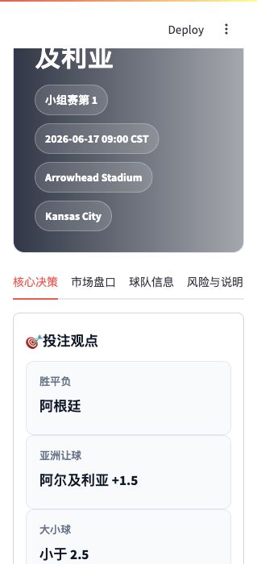

# WorldCup Analyzer

面向中文用户的世界杯赛前分析平台。

系统输入一场比赛，例如：

```text
Argentina vs Algeria
```

页面会汇总赔率市场、预测市场、球队信息和规则决策引擎，帮助用户快速判断：

- 市场当前怎么看
- 是否存在明显市场分歧
- 推荐关注哪个投注方向
- 风险主要在哪里

## 页面截图



## 主要功能

- 比赛概览：赛事、时间、地点、阶段
- 投注观点：胜平负、亚洲让球、大小球
- 决策引擎 V1：市场分歧、逆向分数、爆冷指数、综合信心分
- 胜平负赔率：API-Football
- 亚洲让球盘：API-Football
- 大小球盘口：API-Football
- Polymarket 预测市场：概率、成交量、流动性
- 球队资料：排名、教练、历史成绩、身价估算
- 近期状态：最近5场 / 最近10场
- 伤病与首发：API-Football，未公布时显示市场预测首发
- Markdown 报告导出

## 数据来源

- API-Football：比赛、球队、伤病、首发、近期赛果
- API-Football：胜平负、让球、大小球赔率
- Polymarket Gamma API：预测市场价格、成交量、流动性
- 本地静态资料库：用于免费 API 额度不足时的页面兜底
- Wikimedia Commons：赛事 Banner 图片

## 本地安装

进入项目目录：

```bash
cd worldcup-analyzer
```

创建虚拟环境：

```bash
python3 -m venv .venv
```

启动虚拟环境：

```bash
source .venv/bin/activate
```

安装依赖：

```bash
pip install -r requirements.txt
```

创建本地密钥文件：

```bash
mkdir -p .streamlit
cp .streamlit/secrets.example.toml .streamlit/secrets.toml
```

编辑 `.streamlit/secrets.toml`：

```toml
API_FOOTBALL_KEY = "你的 API-Football Key"
```

启动应用：

```bash
streamlit run app.py
```

本地访问：

```text
http://localhost:8501
```

## Streamlit Cloud 部署

部署步骤见：

[DEPLOY_GUIDE.md](DEPLOY_GUIDE.md)

Streamlit Cloud 配置：

- Repository：你的 GitHub 仓库
- Branch：`main`
- Main file path：`app.py`
- Python：建议 `3.11` 或 `3.12`

Secrets：

```toml
API_FOOTBALL_KEY = "你的 API-Football Key"
```

## 安全说明

不要提交真实密钥。

以下文件已被 `.gitignore` 忽略：

- `.streamlit/secrets.toml`
- `.venv/`
- `__pycache__/`
- `logs/`
- `outputs/reports/`

## 当前限制

- API-Football 免费版有每日请求限制。
- 部分球队资料来自静态资料库，用于页面兜底。
- 预测首发为市场预测首发，不是官方首发。
- 本项目只做赛前分析辅助，不构成投资建议。

<!-- loop-test-run: GitHub Actions + Claude gate smoke test -->
